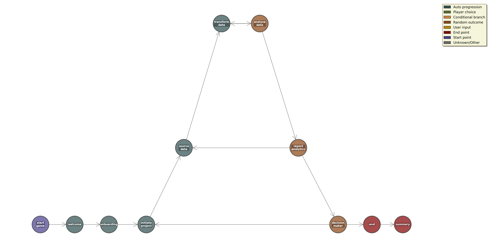

## Press a button now!

## Run the game

```bash
python -m button_1
```

## version: 1

- port to python
- read from a googlesheet so writing is easy
- data collection of previous game events that inform game events

## Narrative graph



- there exists a narrative graph
- narrative nodes represent game screens
- each narrative node has game events that determine the next edge 

## Visualisation of narrative graph

Using dot. 

## Narrative nodes

Each node consists of:

1. Text describing node.
2. Game event determining edge.

## Narrative edge determinisation

